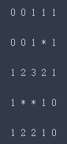
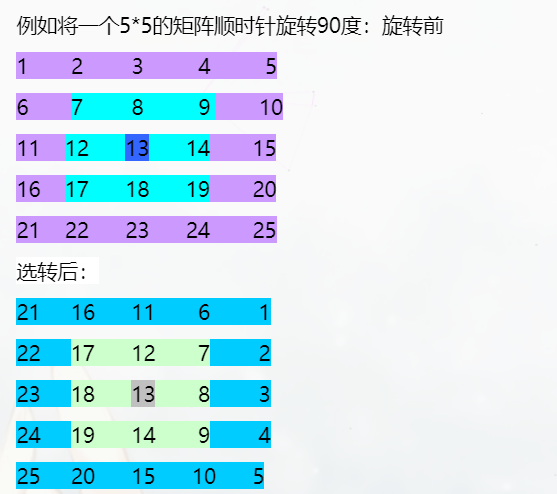

## 数组练习笔记

#### **1. 扫雷棋盘生成**



- 解题要点
    - 以$0.2$概率生成雷
    - 无雷的网格统计$8$邻域的雷数

```python
# 8邻域区域遍历 
# 法1：过滤边界
for i in range(m):
    for j in range(n):
        # 边界区域
        if i == 0 or i == m-1:
            continue
        if j == 0 or j == n-1:
            continue

        for ii in range(-1,2):
            for jj in range(-1,2):
                new_i = i + ii
                new_j = j + jj
                process(new_i, new_j)

# 法2：申请一片更大的内存避免边界问题
matrix = [[0] * (m+2) for _ in range(n+2)]

for i in range(1, m+1):
    for j in range(1, n+1):
        for ii in range(i-1, i+2):
            for jj in range(j-1,j+2):
                process(ii,jj)
```
    
#### **2. 零矩阵**

 - 题目描述：
 	
    给一个m×n的矩阵，如果有一个元素为0，则把该元素对应的行与列所有元素全部变成0
 
     ```C++
     [ 1, 1, 1, 0, 1, 1]        [ 0, 0, 0, 0, 0, 0]
     [ 1, 1, 1, 1, 1, 1]  ----> [ 1, 1, 0, 1, 1, 1]
     [ 1, 1, 0, 1, 1, 1]        [ 0, 0, 0, 0, 0, 0]
     ```
 - 解题要点
     - 统计出现的行与列号，可以用一个数组标记（也可以用set）

	```python
    rows = [0] * m
    cols = [0] * n
    
    for i in range(m):
        for j in range(n):
            if matrix[i][j] == 0:
                rows[i] = 1
                cols[j] = 1
    ```

#### **3. 九宫图生成**

```python

        4 9 2
        3 5 7
        8 1 6

```

- 解题要点
    - 确定起点 1 的位置 $(i,j) =（n-1, n//2）$
    - 从位置$（n-1, n//2）$开始不断向斜下方移动 即
        $$（i, j） --> (i+1, j+1)$$

        - 如果 $(i+1, j+1)$ 越界，则取模循环
        - 如果 $(i+1, j+1)$ 位置已有元素，则转为 $（i-1, j）$

```python
# 取模运算，用作循环
new_row = (row + 1) % n
new_col = (col + 1) % n

# -1 循环，防止负数
row = (row - 1 + n) % n
```

#### **4. 合法的数独**

- 题目描述：

    每行每列每个$3\times3$的块内$1-9$没有重复

- 解法

- 抽屉原则：1-9不能重复，则可以分配9个抽屉，如果元素出现，就放在对应序号的抽屉中（类似零矩阵中的统计数组）
- **bit位的抽屉化，使用比特位替代统计数组**

    ```python
    result = 0

    # 当遇到存在数字 digit 时，则第八个比特位置1
    result | 1<<(digit - 1)

    # 判断数字 digit 是否存在抽屉中
    result & 1<<(digit - 1) == 0
    ```
- **矩阵元素获取（每行、每列、每个$3\times3$ block）**

    ```python
    for i in range(m):
        for j in range(n):
            # j 循环一次 遍历一行的方法
            matrix2D[i][j]；
            matrix1D[i*n + j];

            # j 循环一次 遍历一列
            matrix2D[j][i];
            matrix1D[j*m + i];

            # j 循环一次遍历一次block
            idx_row = (i//3)*3 +j//3
            idx_col = (i%3)*3 + j%3
        ```

#### **5. 旋转数组**

- 题目描述：
	
    给一个n×n的数组，旋转90度

	

- 解法：
   
   ```python
    技巧：先找到对应交换元素索引间的关系，以及各个递增的方向
    保持 i 不动，j++ 的位置映射

    # 第一行 顺时针转的索引变化 从前向后遍历: 行不变 列++
    a[i][j] 表示从 第 i 行，j 不断向后移动，指向将交换的元素 （j++）

    # 最后一列 顺时针转的索引变换 从上至下遍历：倒数列不变，行++
    a[j][N-i+1] 表示 与 i 对称的那一列不动（即倒数第 i 列），j++ 则沿着行向下移动

    # 最后一行，从右向左遍历：倒数行不变，倒数列--
    a[N-i-1][N-j+1] 表示 i 对应的倒数的行 j 对应倒数的列

    # 最左边一列，从下向上遍历： 列不变，倒数行--
    a[N-j+1][i]

    # 最终代码
    # 遍历每一层
    for layer in range(n//2):
        # 遍历每个元素
        i = layer
        for j in range(layer, n - layer + 1):
            tmp = a[i][j]

            a[i][j] = a[n-j+1][i]
            a[n-j+1][i] = a[N-i+1][N-j+1]
            a[N-i+1][N-j+1] = a[j][N-i+1]

            a[j][N-i+1] = tmp
    ```
    
#### **6. 反转字符串**

- 题目描述：

	hello => olleh

- **方法总结**

    - 通过索引翻转

        ```python
        string[::-1]
        ```
    - python的 reverse 函数

        ```python
        reverse(string)
        ```
    - 双指针

        ```python
        ls = list(s)
        l = 0
        r = len(ls) - 1
        while l < r:
            s[l], s[r] = s[r], s[l]
            l+=1
            r-=1
         ```

    - 代码技巧      

       - Python string 类型 **不可变**, 所以处理需要转为list
       - list 转为 string 常用方法

            ```python
            ''.join(l)
            ```
        
#### 7. 最长连续子串

- 题目描述：

	给一个只包含0和1的数组，找出最长的全是1的子数组。

    Example:

    Input: [1,1,0,1,1,1]

    Output: 3
    
- 解法

	需要维护一个全局最大值，一个局部最值，局部最值更新的时候，全局最值需要响应更新
   ```python
   g_max = 0
   l_max = 0
   
   for i in nums:
       if i == 1:
            l_max += 1
            g_max = max(l_max, g_max)
        else:
            l_max = 0
    ```
    
#### 8. 最大数

- 题目描述：

	给定一个数组，数组里有一个数组有且只有一个最大数，判断这个最大数是否是其他数的两倍或更大。如果存在这个数，则返回其index，否则返回-1。
    
- 解法

	- 重点在于最大值和次大值的更新方式

		```python
        if MAX < ele:
        	second = MAX
            MAX = ELE
        elif second < ele:
        	second = ele
        ```
        
#### 9. 寻找消失的数字

- 题目描述：

	在大小为$n$的数组中，$1$ ~ $n$的数组中，部分出现了两次，其他的只出现了一次，能否找到$1$ ~ $n$不存在该数组的数字
    
    Example:

	Input: [4,3,2,7,8,2,3,1]

	Output: [5,6]
    
- 解法：

	- 简单解法，直接通过一个统计数组对出现的数字进行标记，没有标记的是没出现的
	- 使用 $O(1)$ 的空间复杂度，即原地统计，可以使用负号进行标记

		- 遍历数组，遍历到一个元素，将该元素对应的（索引）所在的数字转为负数
		- 遍历数组，只要是正的，对应（索引+1）的元素就不存在

- 核心代码

	```python
    for i in range(len(nums)):
        index = abs(nums[i]) - 1
        nums[index] = - abs(nums[index])) # abs 主要是可能本身的数字已经是负的了
    ```
    
#### 10. 列表的加1运算

- 题目描述：

	$$[1,2,3] -> [1,2,4]$$
    $$[9,9] -> [1,0,0]$$
    
- 解法

	- 从后向前遍历数组，进行 +1 操作
	- 如果需要进位，该元素点置为0，如果遍历到第一个，则在最前面插入 1 即可，否则进行 + 1操作，break即可

- 核心代码

    ```python
    for i in range(len(nums)-1,-1,-1):
    	nums[i] += 1
        if nums[i] == 10:
        	nums[i] = 0
            if i == 0:
            	nums.insert(0,1)
        else:
        	break
    ```

#### 11. 寻找枢纽位置

- 题目描述

	枢纽序号的定义为：此元素左边所有元素之和与此元素右边所有元素之和相等的元素序号。
    
    Example:

	Input: [1,2,3,4,3,2,1]

	Output: 3 

- 解法

	- 从第1个位置开始遍历， 预先求得左边的和以及右边的和
	- 每移动一个位置，分别更新左边以及右边的和，知道相等或者数组遍历结束为止

- 核心代码

	```python
    lsum = 0
    rsum = sum(nums[1:])
    
    for i in range(1,n):
    	lsum += nums[i-1]
        rsum -= nums[i]
    	if lsum == rsum:
        	return i
    ```
    