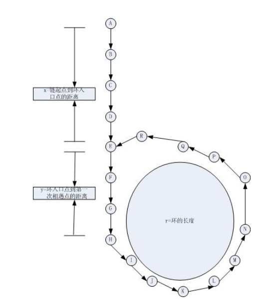

## 链表

#### 基础：链表的实现
- 链表特性

	- 使用固定步数的操作可以在列表中任意节点做插入、删除操作。
	- 不允许随机访问，往往用于不连续内存

- 链表分类

	- 单向链表
	- 循环链表

		链表中的最后一个节点指向第一个节点
	- 双向链表

		链表中的每个节点都有一个前向指针和一个后向指针

- 链表与动态数组的区别

	- 数组 $O(1)$ 尾部插入元素，任意位置插入很慢；链表 $O(1)$ 插入与删除节点
	- 数组支持随机索引 

- 链表的基本操作

	- 空链表的创建

		需要实现 **Node** 的数据结构
        
        需要私有 **哨兵节点** 以及 **节点数量**
	- 链表是否为空

		直接通过 **头部节点是否为 空** 判断
        
        ```python
        self._head == None
        ```
        
	- 链表元素个数
	- 链表的遍历

		从哨兵节点开始，通过 **next指针** 向后移动，直到**当前节点为空**
        ```python
        cur = self._head
        
        while cur:
        	cur = cur.next
        ```
        
    - 从头部插入节点 new_Node

		需要判断头部节点是否为空
        
        ```python
        if self._head == None:
        	self._head = new_Node
            return
        new_Node.next = self._head
        self._head = new_Node
        ```
	- 给定位置 pos 插入元素

		```python
        count = 0
        cur = self._head
        while count < (pos-1):
        	cur = cur.next
        	count += 1    
        new_Node.next = cur.next.next
        cur.next = new_Node
        ```
	- 给定位置 pos 删除元素

		```python
        count = 0
        cur = self._head
        while cout < (pos - 1):
        	cur = cur.next
            count += 1
        cur.next = cur.next.next
        ```
	- 清空列表
	- 查找给定位置的元素	

		同遍历算法
        
#### **1. 删除节点**


- 解题要点

	- 删除头节点

		```python
        new_head = self._head.next
        self._head = None
        self._head = new_head
        ```
    - 删除尾部节点

		```python
        cur = self._head
        while cur.next:
        	cur = cur.next
        cur.next = None
        ```
    
    - 删除中间节点

		```python
        node.next = node.next.next
        ```
 
#### **2. 链表中点**       

- 解题思路

	双指针，一个两步走，一个单步走，两步走的终点就是单步走的中间点
    
- 核心代码

	```python
    fpt = slpt = head
    while fpt and fpt.next:
    	slpt = slpt.next
        fpt = fpt.next.next
    ```
    
#### **3. 链表环**    

- 解题思路

	双指针，有环必然存在快指针和慢指针相同

- 核心代码

	```python
    fpt = slpt = head
    while fpt and fpt.next:
    	slpt = slpt.next
        fpt = fpt.next.next
        if slpt == fpt:
        	return True
    return False
    ```

#### **4. 链表环的入口**   

- 解题思路

	首先必须判断链表有环
    
    
  
   推导：
  $$x - 链表到环的入口距离$$  
  $$y - 环的入口到快慢指针相遇的第一个点距离$$  
  $$r - 环的长度$$
  
  设第一次相遇，慢指针移动 $s = x + y$，则快指针移动了
  $$2*s = x + y + n*r$$
则有：
	$$x + y = n*r$$
    
    $$x = (n-1)r + r - y$$
    
    该式子表明 在相遇后，slow 从起点重新开始走，faster 向后一步走，则必然在入口相遇
    
- 核心代码

	```python
    slpt = fpt = self._head
    has_circle = False
    while fpt and fpt.next:
    	slpt = slpt.next
        fpt = fpt.next.next
   		if slpt == fpt:
        	has_circle = True
            break
            
   	if has_circle:
    	slpt = self._head
        while slpt != fpt:
        	slpt = slpt.next
            fpt = fpt.next
       	return slpt
    ```
    
#### **5. 移除倒数第N个节点**

- 解题思路

	双指针，指针之间固定长度为N，同时移动直到终止
- 核心代码    
    
    ```python
    # 首先确定N 不会大于链表的长度
    spt = head
    fpt = head
    for i in range(N):
    	fpt = fpt.next
        
    while fpt:
    	spt = spt.next
        fpt - fpt.next
    ```
 
 
#### **6. 二分链表**

- 解题思路

	其实就是找到链表的中点
    思路同上题
- 核心代码

	```python
    spt = head
    fpt = head
    while fpt and fpt.next:
    	spt = spt.next
        fpt - fpt.next.next
    ```

#### **7. 归并两个有序链表**

- 题目描述

	合并两个有序链表，并返回一个新的链表
    
    ```python
    input: 
    	1->2->4  
    	1->3->4
    
    output:
    	1->1->2->3->4->4
    ```
- 解题思路及核心代码

	- 归并排序
    
    ```python
    left = head1
    right = head2
    
    head = Node(0)
    cur = head
    
    while left and right:
    	if left.val < right.val:
        	cur.next = left
            left = left.next
        else
        	cur.next = right
            right = right.next
       	cur = cur.next
        
    cur.next = left or right
    ```
 
 - 递归解法

	```python
    def mergeTwoLists(l1, l2):
    	if not l1 or not l2:
        	return l1 or l2
        if l1.val < l2.val:
        	l1.next = mergeTwoLists(l1.next, l2)
            return l1
        else:
        	l2.next = mergeTwoLists(l1, l2.next)
            return l2
    ```
    
#### **8. 两个链表公共部分的节点**

- 题目描述

	```python
    	a1 -- a2
    			\ 
            	 c1 -- c2 -- c3
    			 /
    b1 -- b2 -- b3
    
    返回 节点 c1
    ```
    
- 解题思路

	两个指针分别向后移动，指针为空，从头开始移动，直到相等；另一种，找到两个链表长度差值，来获取交点
    
- 核心代码

	```python
    A = headA
    B = headB
    
    while A != B:
    	if not A:
        	A = headA
        if not B:
        	B = headB
        
        A = A.next
        B = B.next
    ```
    
#### **9. 链表的插入排序**

- 解题思路

	插入排序，将链表分为两部分，前一部分有序，后一部分无序，遍历无序的数组，并确定每个元素在前一部分元素的插入位置，进行插入操作
    
 ```python
 1. 确定插入位置
  pre        cur
  1 --> 3 --> 2 --> 4
 
 pre.next.val > cur.val 
 
 使用 pre.next 比较主要是因为 pre.next 才是插入的位置
 
 2. 插入节点
  1 --> 2 --> 3 --> 4	
 ```

- 核心代码

	```python
    while cur is not None:
        pre = dummy
        while pre.next is not None and pre.next.value < cur.value:
            pre = pre.next
        if pre == cur:
            cur = cur.next
        else:
        	# 插入节点
    ```
    
#### **10. 链表的归并排序**

- 解题思路

	链表的归并排序关键是找到链表的中间节点，将链表分成两部分，最后进行合并
    
- 核心代码

	```python
	def sortList(head):
    	if head is None or head.next is None:
       	 	return head
            
        mid = getMid(head)
        rhead = mid.next
        mid.next = None
        lhead = sortList(head)
        rhead = sortList(rHead)
        return merge(lhead, rhead)  
    ```

#### **11. 链表的分区**

- 解题思路

	- 建立两个 dummpy node，分别指向分区的左右链表
	- 遍历整个链表，将小于或大于 pivot 的节点，分成两个链表

- 核心代码

	```python
    cur = head
    lhead = rhead = Node(0)
    lpt = lhead
    rpt = rhead
    while cur:
    	if cur.val < pivot.val:
        	lpt.next = cur
            lpt = lpt.next
        else:
        	rpt.next = cur
            rpt = rpt.next
       cur = cur.next
    ```
    
#### **12. 反转链表**

- 解题思路
	
    **熟悉该问题是解决反转问题的基础**
	
    
 	```python
     pre   cur   tmp
     null   1 --> 2 --> 3 --> 4
    
     pre      cur   tmp
     null <--  1     2 --> 3 --> 4
     
     	      pre   cur
     null <--  1     2 --> 3 --> 4
     注意到最终形成部分的链表，pre为链表头，cur为另一个链表头
    ```
    
- 核心代码

	```python
    pre = None
    cur = head
    while cur:
    	tmp = cur.next
        cur.next = pre
        
        pre = cur
        cur = tmp
    ```
    
#### **13. 指定位置反转链表**

- 题目描述

	基于给定位置 m ，n的位置翻转链表
    ```python
    For example:

    Given 1->2->3->4->5->NULL, m = 2 and n = 4,

    return 1->4->3->2->5->NULL.
    ```
    
- 解题思路

	重点在于控制交换的次数为 $n - m + 1$，并且处理好头尾的关系，以及反转过后的位置关系
    
    ```python
    设 m = 2, n = 4
    反转前：
        pre                     
         1 --> 2 --> 3 --> 4 --> 5 -->|
   
    反转后：
               ----------------   
    	pre    |               |
               |               v
         1 - - |  4 --> 3 -->  2     5 -->|
         		 res          |    cur
   							|
                               v
                             NULL
         
         pre.next.next = cur
         pre.next = res
         1 - -> 4 --> 3 --> 2 --> 5 -->|
   ```
   
- 核心代码

	```python
    pre = dummyNode

    for i in range(m - 1):
        pre = pre.next

    # reverse the [m, n] nodes
    result = None
    current = pre.next
    for i in range(n - m + 1):
        nxt = current.next
        current.next = result
        result = current
        current = nxt
    ```
 
#### **14. 链表每两个相邻节点进行反转链表** 

- 题目描述

	For example, 

	Given 1->2->3->4, you should return the list as 2->1->4->3.
    
#### **15. 链表按组进行反转链表** 

- 题目描述

	For example,

    Given this linked list: 1->2->3->4->5

    For k = 2, you should return: 2->1->4->3->5

    For k = 3, you should return: 3->2->1->4->5
    
- 解题思路

	将上述问题分解为：
    - 确定循环的次数，每次进行组节点反转
    - 针对每次反转以之前反转的思路相同
    - 处理尾部指针指向


#### **16. 回文链表判断** 

- 题目描述

	在 时间复杂度 $O(n)$ 空间复杂度 $O(1)$下实现回文链表判断
   
- 解题思路

	1. 找到链表中间节点
	2. 对前一部分或者后一部分进行反转
	3. 前后一一比较即可

#### **17. 剔除重复节点**

- 题目描述

	For example,

    Given 1->1->2, return 1->2.

    Given 1->1->2->3->3, return 1->2->3.
    
- 解题思路

	```python
    cur         dst
     1 --> 1 --> 2 --> 3 --> 3
     
     记录开始的 cur，并找到给定的 dst 进行链接
    ```
    
- 核心代码    

	```python
    cur = head
    while cur.next:
    	dst = cur
        while dst.value == dst.next.value:
        	dst = dst.next
        dst = dst.next
        cur.next = dst
        cur = dst
    ```
 
#### **18. 完全剔除重复节点**

- 题目描述

	完全删掉重复节点
    
    For example,

    Given 1->2->3->3->4->4->5, return 1->2->5.

    Given 1->1->1->2->3, return 2->3.

- 解题思路

	```python
     pre    cur         dst
     dum --> 1 --> 1 --> 2 --> 3 --> 3
     
     记录开始的 cur，并找到给定的 dst 进行链接
    ```
    
- 核心代码

	```python
    dummy = pre = Node(0)
    dummy.next = head
    while head and head.next:
    	# 存在重复的情形
        if head.value == head.next.value:
            while head and head.next and head.value == head.next.value:
                head = head.next
            head = head.next
            pre.next = head
        else:
            pre = pre.next
            head = head.next
    ```