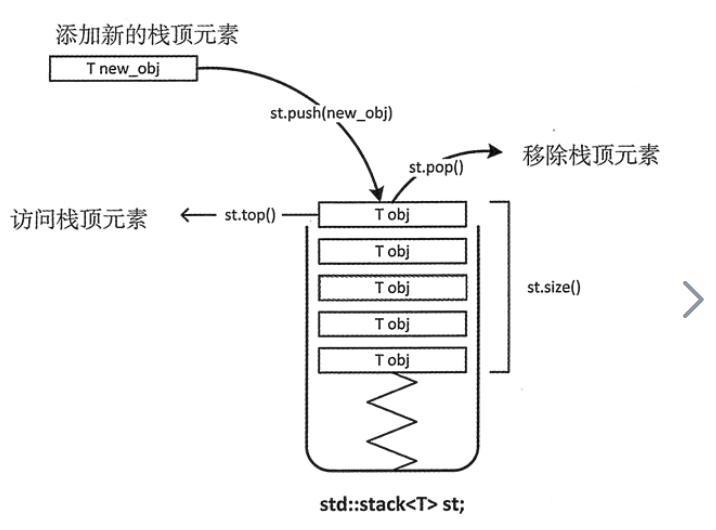
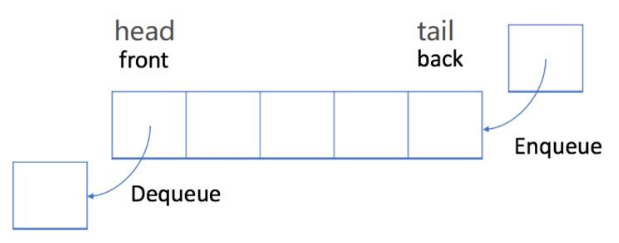

## Stack

- Stack 的实现

	- 特点：后进先出
	
	- 基本操作：
		- push：将元素压入栈顶
		- pop：将栈顶元素弹出
		- size：获取stack 元素数量
		- peek：返回栈顶元素，不进行弹出

	- 实现手段

		- 数组实现
		- 链表实现

			- 链表头作为栈顶

- Queue 的实现

	- 特点：先进先出
	
	- 基本操作：
		- enqueue：将一个元素添加到队列的末尾
		- dequeue：从队列首移除一个元素
		- size: 返回队列中元素数量
		- peek：返回队首元素而不删除它
	- 实现手段：
		- 数组实现：基于循环数组
			- 成员变量
				
                - 一个可变长的数组 self.queue
                - 记录队首在数组的位置 self.front
                - 记录队的大小 self.size
                - 数组原有容量 capacity
            - 成员方法

				- 入队
					
                    - 需要判断数组的 size 是否已经超过数组容量 capacity
                    - 超过容量，需要重新分配更大的数组，涉及到数组的拷贝移动 
                    ```python
                    old = self.queue
                    self.queue = [None] * queue.capacity
                    walk = self.front
                    for i in range(self.size):
                        self.queue[i] = old[walk]
                        walk = (walk + 1) % self.size
                    self.front = 0
                    ```
                    
                    - 获取队尾在数组的位置，注意循环

					```python
                    pos = （self.front + self.size）% capacity
                    ```
                 
                - 出队

					- 返回 self.front 位置的值即可，需要更新 self.front
					```python
                    self.front = (self.front + 1) % capacity
                    ```
			
		- 链表实现：基于首尾指针的链表实现
	
#### **1. 用栈来实现队列**    

- 解题思路

	使用两个 **stack** 实现 **queue**
    
    - 一个 **stack** 用来入队，一个 **stack** 用来出队
    - 出队时，没有元素则需要从入队的 **stack** 弹出队首元素

- 核心代码

	```python
    # 出队
    def dequeue(self):
    	if self.out_stack:
        	return self.out_stack.pop()
        else:
        	if self.in_stack:
            	while self.in_stack:
                	self.out_stack.append(self.in_stack.pop())
                return self.out_stack.pop()
            else:
            	ERROR
    ```
    
#### **2. 用队列来实现栈**

- 解题思路

	每次压入队列，都需要对队列进行反转 $size - 1$ 次，保证刚入队的元素处于队首
    
- 核心代码

	```python
    def push(self, item):
        self.size += 1
        self.queue.append(item)

        for i in range(self.size - 1):
            self.queue.append(self.queue.pop(0))
    ```

#### **3. 最小堆栈**

- 题目描述

	设计一个 **getMin()** 函数获取堆栈中最小值
    
- 解题思路

	另外存储一个栈，用来存储压栈出栈之中的最小值，该最小值也要随着压栈出栈的操作进行更新
 
- 核心代码

	```python
    def push(self, item):
        self.instack.append(item)

        if not self.minstack:
            self.minstack.append(item)
        else:
            if item <= self.minstack[-1]:
                self.minstack.append(item)
    ```
    
#### **4. 使用一个数组实现两个stack**

- 解题思路

	将数组的两端作为两个 stack 的栈底，一个 stack 从数组头部自上而下插入，并标记尾部的self.top1，另一个 stack 从数组尾部自下而上插入，并标记尾部的self.top2，直到两者相撞退出
    
#### **5. stack 升序排序**

- 解题思路

	通过一个辅助的（有序） stack 实现排序
    
    - 每次从原始 stack 弹出一个待排序元素，只要辅助 stack 的栈顶大于待排序元素，就将这些元素弹到原来的栈中
    - 将待排序元素压入辅助栈中
    - 直到原始栈为空

- 核心代码

	```python
    def sortstack(stack):
        tmpstack = []  # 辅助栈

        while stack:
            tmp = tmpstack.pop()

            # 查找 tmp 应该在的位置
            while tmpstack and tmpstack[-1] > tmp:
                stack.append(tmpstack.pop())
            tmpstack.append(tmp)

        return tmpstack
    ```

#### **6. 字符串逆序**

- 解题思路

	压入栈再弹出即为结果
    
#### **7. 回文串**

- 解题思路

	使用逆序方法
    
    
#### **8. 有效括号匹配**    

- 解题思路

	- 遇到左括号，就压入栈
	- 遇到右括号

		- 如果栈空或者栈顶元素不为对应的左括号，则无效
		- 弹出栈顶元素，继续下一轮判断

- 核心代码 

	借助字典的对应关系简化代码
    
    ```python
    dic = {')': '(', ']': '[', '}': '{'}

    for ele in s:
        if s not in dic:
            stack.append(s)
        else:
            if not stack:
                return False
            elif dic[ele] == stack[-1]:
                stack.pop()
            else:
                return False
    ```
    
#### **9. 路径简化**

- 题目描述

	采用 Unix 的路径简化
    
    ```python
    For example,

    path = "/home/" => "/home"

    path = "/a/./b/../../c/" => "/c"
    ```
   
- 解题思路

	对于不同的字符对栈的操作不同：
    
    ```python
    首先去掉 / 
    . 或者 '' 表示不操作
    .. 弹出
    其他表示压入栈
    ```
    
    输出的时候补上 / 
    
- 核心代码

	```python
    # 输出处理
    if len(lst) == 0:
        return "/"
    result = ['/' + i for i in lst]
    ```
    
#### **10. 解码字符串**

- 题目描述

	```python
    Examples:

    s = "3[a]2[bc]", return "aaabcbc".

    s = "3[a2[c]]", return "accaccacc".

    s = "2[abc]3[cd]ef", return "abcabccdcdcdef".
    ```
    
- 解题思路

	将元组（string，int） 作为栈元素存储到栈中
	- 遇到一个左括号的时候

		需要存储字符串到string中
    
    - 遇到一个右括号，将string * int 展开至前一个元素的 string 中
    
    - 数字则继续添加

- 核心代码

	```python
    if ch.isdigit():
        num += ch
    elif ch == '[':
    	# 
        stack.append(['', int(num)])
        num = ''
    elif ch == ']':
        st, k = stack.pop()
        stack[-1][0] += st * k
    else:
        stack[-1][0] += ch
    ```
    
#### **11. 球类游戏**

- 题目描述

	```python
    游戏规则：
    正数：获取分数
    + ： 上两轮有效分数之和
    D ： 上一个分数的2倍
    C ： 上一个分数无效
    ```
    
- 解题思路

	将游戏规则化为 栈的操作
    
- 核心代码

	```python
    if op == '+':
        stack.append(stack[-1] + stack[-2])
    elif op == 'C':
        stack.pop()
    elif op == 'D':
        stack.append(2 * stack[-1])
    else:
        stack.append(int(op))
    ```
    
#### **12. 星球碰撞**

- 题目描述

	一个数组，元素的绝对值表示星球质量，正负表示方向，方向不同会碰撞，质量小的星球会消失，如果质量相同都会消失
    
    ```python
    Example 1:

    Input: asteroids = [5, 10, -5]
    Output: [5, 10]
    Explanation: The 10 and -5 collide resulting in 10. The 5 and 10 never collide.
    Example 2:

    Input: asteroids = [10, 2, -5]
    Output: [10]
    Explanation: The 2 and -5 collide resulting in -5. The 10 and -5 collide resulting in 10.
    Example 3:

    Input: asteroids = [-2, -1, 1, 2]
    Output: [-2, -1, 1, 2]
    Explanation: The -2 and -1 are moving left, while the 1 and 2 are moving right.
    Asteroids moving the same direction never meet, so no asteroids will meet each other.
    ```
 
- 解题思路

	需要注意负数星球向左移动，如果前面没有正的则不会相碰

- 核心代码

	```python
    if ans and new < 0 < ans[-1]:
        if ans[-1] <= -new:
            ans.pop()
    else:
        ans.append(new)
    ```
    
#### **13. 下一个最大元素**

- 题目描述

	给定一个数组，为每个元素找到右边第一个最大的元素，没有最大的则为-1
    
    ```python
    [6, 4, 5, 2, 25]
    
    4 :  5
    2 :  25
    5 :  25
    6 :  25
    25 : -1
    ```
    
- 解题思路

	将待求的元素压入栈，每次找到一个答案，就将栈中小于答案的元素 弹出
    
    - 将第一个元素压入栈
    - for [1:len(nums)] 遍历数组

		- 判断遍历的元素 e 和栈顶元素的关系

			- 如果 e 小于栈顶元素，就加入栈，表明该元素尚未找到答案
			- 如果 e 大于栈顶元素，则栈中每次弹出小于该栈顶的元素，且 e 就是这些栈顶元素的答案
	
    - 如果栈中还有元素，则无答案

- 核心代码

	```python
    for i in range(1, len(nums)):
        while stack and nums[i] > stack[-1]:
        	# 获取答案
            num = stack.pop()
            print(num, ": ", array[i])
        # 待求元素
        stack.append(nums[i])
    ```
    
#### **14. 下一个最大元素II**

- 题目描述

	数组为循环数组，即最后的元素可以继续返回数组头部检查
    
- 解题思路

	在上题的基础上，stack 如果不为空，则继续从头遍历数组，同样的思路找寻答案直到stack为空，则终止
    
- 核心代码

	```python
    for i in range(len(nums)):
        while stack and (nums[stack[-1]] < nums[i]):
            r[stack.pop()] = nums[i]
        stack.append(i)
    print(r)
    for i in range(len(nums)):
        while stack and (nums[stack[-1]] < nums[i]):
            r[stack.pop()] = nums[i]
        if stack == []:
            break
    ```
    
#### **15. 日常温度**    

- 题目描述

	给定一个数组记录了每天的温度，为每一天确定需要隔多少天才会温度升高，如果不可能则为0
    
    ```python
    For example, given the list temperatures 
    [73, 74, 75, 71, 69, 72, 76, 73], 
    output should be 
    [1, 1, 4, 2, 1, 1, 0, 0].
    ```
    
- 解题思路

	借鉴上题的思路，首先确定之后的最大值，统计弹出的次数即可，也可以将元素以及index作为元组作为元素放入栈中
    
- 核心代码
	
    ```python
    for i in range(1, len(temperatures)):
        while stack:
            prev = stack[-1]
            if prev[0] < temperatures[i]:
                result[prev[1]] = i - prev[1]
                stack.pop()
            else:
                break
        stack.append((temperatures[i], i))
    ```

#### **16. 滑动窗口最大值**  

- 题目描述

	以 k 为窗口滑动，取出窗口的最大值
    
- 解题思路

	维持一个窗口，这个窗口是一个双端队列，首先维持窗口大小恒为 k，同时将不可能称为最大值的元素弹出窗口
    
- 核心代码

	```python
       if i + 1 >= k and window[0] + k <= i:
            window.pop(0)

        while window and arr[window[-1]] <= ele:
            window.pop()

        window.append(i)

        if i + 1 >= k:
            res.append(arr[window[0]])
    ```