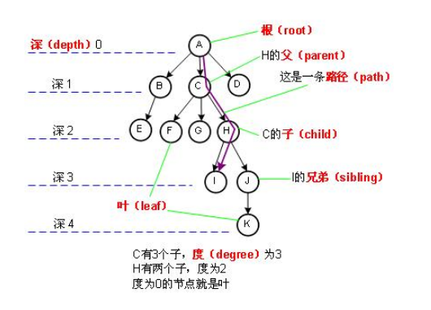
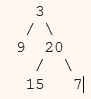
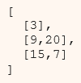
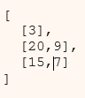
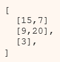
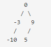

## 树

- 树的术语

	**节点的度**：一个节点含有的子树的个数称为该节点的度；

    **树的度**：一棵树中，最大的节点的度称为树的度；

    **叶节点或终端节点**：度为零的节点；

    **父亲节点或父节点**：若一个节点含有子节点，则这个节点称为其子节点的父节点；

    **孩子节点或子节点**：一个节点含有的子树的根节点称为该节点的子节点；

    **兄弟节点**：具有相同父节点的节点互称为兄弟节点；

    **节点的层次**：从根开始定义起，根为第1层，根的子节点为第2层，以此类推；

    **树的高度或深度**：树中节点的最大层次；

    **堂兄弟节点**：父节点在同一层的节点互为堂兄弟；

    **节点的祖先**：从根到该节点所经分支上的所有节点；

    **子孙**：以某节点为根的子树中任一节点都称为该节点的子孙。

    **森林**：由m（m>=0）棵互不相交的树的集合称为森林
    
    

- 二叉树的种类

	- 满二叉树

		完整的二叉树是一棵树，树叶中的每个节点都有两个孩子
    
    - 完全二叉树

		在一棵二叉树中，除最后一层外，若其余层都是满的，并且或者最后一层是满的，或者是在右边缺少连续若干结点，则此二叉树为完全二叉树。
	
    - 平衡二叉树

		它是一棵空树或它的左右两个子树的高度差的绝对值不超过1，并且左右两个子树都是一颗平衡二叉树

- 二叉搜索树（BST）

	- 定义

		左孩子比父节点小，右孩子比父节点大
    
    - 二叉树的实现

		- 二叉树大小
		- 最大深度
		- 二叉树是否为空
		- 二叉树查找
		- 二叉树的节点插入
		- 二叉树的遍历

			- 前序遍历
			- 后续遍历
			- 中序遍历

#### **1. 字频统计**

- 题目描述

	计算树的容量
    
- 核心代码

	```python
    def _size(node):
        if not node:
            return 0
        return _size(node._left) + _size(node._right) + 1
    ```

#### **2. 最大深度**

- 题目描述

	求一棵树的最大深度
    
- 核心代码

	```python
    def _maxDepth(node):
        if (not node):
            return 0
        left_depth = _maxDepth(node._left)
        right_depth = _maxDepth(node._right)
        return max(left_depth, right_depth) + 1
    ```
    
#### **3. 判断平衡二叉树**

- 题目描述

	判断左右子树的高度是否相差 1
    
- 解题思路

	找到树的最大深度和最小深度，判断是否差 1
    
- 核心代码

	```python
    def minDepth(self):
        return self._minDepth(self._root)
    
    def _minDepth(self, node):
        if (not node):
            return 0
        left_depth = self._minDepth(node._left)
        right_depth = self._minDepth(node._right)
        return min(left_depth, right_depth) + 1
    
    def isBalanced(self):
        return (self.maxDepth() - self.minDepth()) <= 1
    ```
    
#### **4. 二叉树的floor 和 ceil** 

- 题目描述

	给定一棵二叉搜索树和一个节点，查找该节点在二叉树中的上下界

- 解题思路

	查找 floor ，floor 必定出现左子树，ceil 必定出现在右子树

- 核心代码

	```python
    def _floor(self, node, key):
        if (not node):
            return None
        if (key == node._item):
            return node
        if (key < node._item):
            return self._floor(node._left, key)
        t = self._floor(node._right, key)
        if t:
            return t
        return node
        
    def _ceil(node, key):
        if node is None:
            return None

        if node.value == key:
            return node

        if node.value < key:
            return _ceil(node.right, key)

        t = _ceil(node.left, key)

        if t:
            return t

        return node    
    ```
    
#### **5. 判断是不是二叉搜索树**

- 题目描述

	当前节点大于左子节点、小于右子节点
    
- 解题思路

	只要找到一个不满足条件的节点，就可以判断为假
    
- 核心代码

	```C++
    def _isBST(self, node, minval, maxval):
        if not node:
            return True
        if (node._item < minval or node._item > maxval):
            return False
        return self._isBST(node._left, minval, node._item) and self._isBST(node._right, node._item, maxval)
    ```

#### **6. 树的镜像**

- 题目描述

	将树镜像变换
    
- 核心代码

	```python
    def _mirror(node):
    	if node is None:
        	return;
        
        _mirror(node.left)
        _mirror(node.right)
        
        node.left, node.right = node.right, node.left
    ```
    
#### **7. 判断两棵树是否相同**

- 解题思路

	判断节点是否相同，并递归判断左右子树
    
- 核心代码

	```python
    def _sameTree(nodeA, nodeB):
        if (nodeA is None and nodeB is None):
            return True
        if (nodeA is not None and nodeB is not None):
            return nodeA._item == nodeB._item and _sameTree(nodeA._left, nodeB._left) and _sameTree(nodeA._right, nodeB._right)
        return False
    ```
    
#### **8. 判断一棵树是否对称**    

- 解题思路

	判断树是否对称，值不必相等
    
- 核心代码

	```python
    def _isFoldable(nodeA, nodeB):
        if (nodeA is None and nodeB is None):
            return True
        if (nodeA is None or nodeB is None):
            return False        
        return _isFoldable(nodeA._left, nodeB._right) and _isFoldable(nodeA._right, nodeB._left)
    ```
    
#### **9. 二叉树迭代法查找节点**

- 解题思路

	使用迭代法查找节点
    
- 核心代码

	```python
     def getIterative(root, key):
        node = root
        while node:
            if key == node._item:
                return node._item
            if key < node._item:
                node = node._left
            else:
                node = node._right
        return None
    ```
    
#### **10. 二叉树迭代法插入节点**  

- 核心代码

	```python
    current = root
    parent = None
    while True:
        parent = current
        if (value == current._item):
            return
        if (value < current._item):
            current = current._left
            if (current is None):
                parent._left = newNode
                return
        else:
            current = current._right
            if (current is None):
                parent._right = newNode
                return
    ```
    
#### **11. 中序遍历**

- 题目描述

	迭代法以及递归法 （左根右）
    
- 核心代码

	- 递归
	
	```python
    def _print_inorder(node):
        if (node is None):
            return
        _print_inorder(node._left)
        print ('[', node._item, ']', end = " ")
        _print_inorder(node._right)
    ```
    
  - 迭代

	```python
    def printInorderIterative():
        node = self._root
        stack = []
        
        while True:
            while (node is not None):
                stack.append(node)
                node = node._left
            if len(stack) == 0:
                return
            
            node = stack.pop()
            # 左子树的子节点
            print ('[', node._item, ']', end = " ")
            node = node._right
   	```
    
#### **12. 前序遍历**

- 题目描述

	根左右遍历
    
- 核心代码

	- 递归

    ```python
    def _print_preorder(node):
        if (node is None):
            return
        print ('[', node._item, ']', end = " ")
        _print_preorder(node._left)
        _print_preorder(node._right) 
    ```
    
    - 迭代

	```python
    def printPreorderIterative():
        ret = []
        stack = [self._root]
        while stack:
            node = stack.pop()
            if node:
                ret.append(node._item)
                stack.append(node._right)
                stack.append(node._left)
        return ret
    ```
 
#### **13. 后序遍历**

- 题目描述

	左右根
    
- 核心代码

	- 递归

	```python
    def _print_preorder(node):
        if (node is None):
            return
        _print_preorder(node._left)
        _print_preorder(node._right) 
        print ('[', node._item, ']', end = " ")
    ```
    
    - 迭代

	```python
    def printPostorderIterative2():
        stack = [(self._root, False)]
        while stack:
            node, visited = stack.pop()
            if node:
                if visited:
                    # add to result if visited
                    print ('[', node._item, ']', end = " ")
                else:
                    # post-order
                    stack.append((node, True))
                    stack.append((node._right, False))
                    stack.append((node._left, False))
    ```
    
#### **14. 层次遍历**    

- 题目描述

	
    
    
- 核心代码

	```python
    ret = []
    level = [self._root]

    while level:
    	# 保存中间结果
        currentNodes = []
        # 下一层的遍历范围
        nextLevel = []
        for node in level:
            currentNodes.append(node._item)
            if node._left:
                nextLevel.append(node._left)
            if node._right:
                nextLevel.append(node._right)
        ret.append(currentNodes)
        level = nextLevel
    ```

#### **15. Z层次遍历**

- 题目描述

	
     
    
- 解题思路

	从 0 开始，偶数行不变，奇数行放置顺序相反
    
- 核心代码

	```python
    res, temp, stack, flag = [], [], [self._root], 1
    while stack:
        for i in range(len(stack)):
            node = stack.pop(0)
            temp += [node._item]
            if node._left:  
                stack += [node._left]
            if node._right: 
                stack += [node._right]
        res += [temp[::flag]]
        temp = []
        flag *= -1
    ```
    
#### **16. 层次遍历II**

- 题目描述

	
     
    
- 核心代码

	```python
    ans, level = [], [self._root]
    while level:
        ans.append([node._item for node in level])
        temp = []
        for node in level:
            temp.extend([node._left, node._right])
        level = [leaf for leaf in temp if leaf]
    ans.reverse() # 反转结果
    return ans 
    ```

#### **17. 基于前序遍历和中序遍历重建二叉树**

- 题目描述

	```python
    For example, given

    preorder = [3,9,20,15,7]

    inorder = [9,3,15,20,7]

    Return the following binary tree:
    ```
    
    
    
- 核心代码

	```python
    root = pre[0]
    node = treeNode(root)

    index = tin.index(root)

    node.left = reConstructBinaryTree(pre[1:index+1], tin[:index])
    node.right = reConstructBinaryTree(pre[index+1:], tin[index+1:])
    ```
    
#### **18. 基于中序遍历和后序遍历重建二叉树**    

- 题目描述

	```python
    For example, given

    inorder = [9,3,15,20,7]

    postorder = [9,15,7,20,3]

    Return the following binary tree:
    ```
    
    
    
- 核心代码

	```python
    root = post[-1]

    node = treeNode(root)
    index = tin.index(root)

    node.left = reConstructionBinaryTree_midpost(tin[:index], post[:index])
    node.right = reConstructionBinaryTree_midpost(tin[index+1:], post[index:-1])
    ```

#### **19. 基于有序数组重建二分搜索树** 

- 题目描述

	```python
    Given the sorted array: [-10,-3,0,5,9],

	One possible answer is: 
    ```
    
    
    
- 核心代码

	```python
    mid = len(num) // 2

    root = Node(num[mid])
    root._left = sortedArrayToBST(num[:mid])
    root._right = sortedArrayToBST(num[mid+1:])
    ```
    
#### **20. 基于有序链表重建二分搜索树**

- 解题思路

	寻找链表的中点
    
- 核心代码

	```python
    fast = head
    slow = head
    left_tail = head
    
    while fast is not None and fast.next is not None:
        fast = fast.next.next
        left_tail = slow
        slow = slow.next
    
    left_tail.next = None
    node = Node(slow.value)
    node._left = sortedListToBST(head.next)
    node._right = sortedListToBST(slow.next)
    ```
    
#### **21. 路径求和**

- 题目描述
    
    是否存在从一棵二叉树的根节点到叶节点加和为给定值
   
   

- 核心代码    

	```python
    def hasPathSumHelper(self, node, s):
        if not node:
            return False

        if not node._left and not node._right and node._item == s:
            return True
        
        s -= node._item

        return self.hasPathSumHelper(node._left, s) or self.hasPathSumHelper(node._right, s)
    
    def hasPathSum(self, s):
        return self.hasPathSumHelper(self._root, s)
    ```

#### **22. 路径求和II**

- 题目描述

	打印从一棵二叉树的根节点到叶节点加和为给定值的所有路径
    
     
    
- 核心代码

	```python
    def hasPathSum2Helper(self, node, s):
        if not node:
            return []
        res = []
        self.dfs(node, s, [], res)
        return res
    
    def dfs(self, node, s, ls, res):
        if not node._left and not node._right and s == node._item:
            ls.append(node._item)
            res.append(ls)
        if node._left:
            self.dfs(node._left, s-node._item, ls+[node._item], res)
        if node._right:
            self.dfs(node._right, s-node._item, ls+[node._item], res)
    ```
    
#### **23. 路径求和III**

- 题目描述

	给出满足以下条件的数量：不需要从根节点出发，叶子结点结束的路径，和为 给定的值
    
    
    
- 核心代码

	```python
    def findPath(node, target):
    	if node == NULL:
        	return 0
        
       	res = 0
        if node.val == target:
        	res += 1
        
        res += findPath(node.left, target-node.val)
        res += findPath(node.right, target-node.val)
        
        return res
    	
    def pathSum(node, target):
    	if node == None:
        	return 0
        
        res = findPath(node, target)
        res += pathSum(node.left, target)
        res += pathSum(node.right, target)
        
        return res
    ```
    
#### **24. 二分搜索树的共同祖先**

- 题目描述

	给定一棵二分搜索树以及两个节点，找到最近的公共祖先
    
- 核心代码

	```python
    def _lowestCommonAncestor_binary(node, p, q):
        if node.value < p.value and node.value < q.value:
            return _lowestCommonAncestor_binary(node.right, p, q)

        if node.value > p.value and node.value > q.value:
            return _lowestCommonAncestor_binary(node.left, p, q)

        return node
    ```