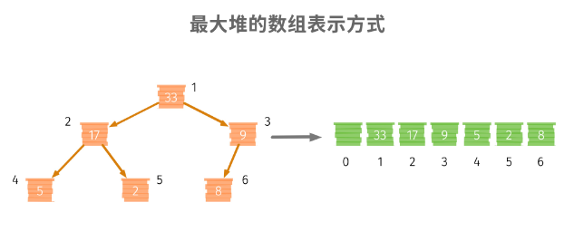

## Heap 堆

- **heap 的实现- 以 MaxHeap 为例**

	基于数组实现 heap
    
    
    
    - 成员变量

		```python
        # 数组容量
        self._capacity = capacity
        # 数组数量
        self._count = 0
        self._data = [None] * capacity
        ```
    
    - 基本操作

		- 判空

		```python
        self._count == 0
        ```
        
        - size

		```python
        self._count
       	```
        
        - 添加元素
		
        	在堆的**最后添加节点**，采用**向上浮动调整堆**
            
            以索引 $1$ 为起始索引，则子节点索引 $i$ 对应父节点 索引 $i // 2$
		```python
        while index >= 1 and self._data[index] > self._data[index // 2]:
            self._data[index], self._data[index//2] = self._data[index // 2], self._data[index]
            index = index // 2
        ```
        
        - 弹出最大值

			弹出堆顶，并**将堆中最后的元素放置堆顶**，并**向下浮动调整堆**
            
        ```python
        def _shift_down(self, index):
            while 2 * index < self._count:
                k = 2 * index
                if k + 1 < self._count and self._data[k + 1] > self._data[k]:
                    k += 1
                if self._data[index] > self._data[k]:
                	break
                self._data[k], self._data[index] = self._data[index], self._data[k]
                index = k
        ```

#### **1. 数组中第 K 大的元素**

- 解题思路

	维护一个 具有 $10$ 个元素的最小堆

- 核心代码

	```python
    heap = []
    for num in nums:
        heapq.heappush(heap, num)
        if len(heap) > k:
            heapq.heappop(heap)
    ```

#### **2. 词组中Top K 大的词频**

- 解题思路

	统计词频，使用堆
    
- 核心代码

	```python
    class Element:
        def __init__(self, word, count):
            self._count = count
            self._word = word

        def __lt__(self, other):
            if self._count == other._count:
                return self._word < other._word
            return self._count < other._count

        def __eq__(self, other):
            return self._count == other._count and self._word == other._word

    def topKFrequent(words, k):
        dic = {}
        for word in words:
            dic[word] = dic.setdefault(word, 0) + 1

        heap = []
        res = []
        for word, count in dic.items():
            heapq.heappush(heap, Element(word, -count))

            if len(heap) > (len(dic) - k):
                res.append(heapq.heappop(heap)._word)

        return res
    ```
    
#### **3. 丑数**

- 题目描述

	对于因子只有 $2,3,5$ 的正整数为丑数
    
- 核心代码

	```python
    seq = [2, 3, 5]

    for t in seq:
        while num % t == 0:
            num //= t

    return num == 1
    ```
    
#### **4. 丑数II**

- 题目描述

	查找第 n 个丑数
    
- 核心代码

	```python
    q2, q3, q5 = [2], [3], [5]

    ugly = 1
    for u in heapq.merge(q2, q3, q5):
        if n == 1:
            return ugly
        if u > ugly:
            ugly = u
            n -= 1
            q2 += [u * 2]
            q3 += [u * 3]
            q5 += [u * 5]
    ```
    
#### **5. 查找和最小的 K 组值**

- 题目描述

	```python
    给定两个有序数组，找到和最小的 k 个pair (u1,v1),(u2,v2) ...(uk,vk)
    ```

- 解题思路

	基本思想：使用 min_heap 跟踪下一个最小对和，我们只需要在数据结构中维护 K 个可能的候选者。
    
    对于 nums1 中的每个数字，它的最佳搭档（yields min sum）总是从 nums2[0] 开始，因为数组都已排序； 对于 nums1 中的特定数字，其下一个候选应该是 [这个特定数字] + nums2[current_related_index + 1]，除非超出边界；)
	
- 核心代码

	```python
    queue = []
    def push(i, j):
        if i < len(nums1) and j < len(nums2):
            heapq.heappush(queue, [nums1[i] + nums2[j], i, j])
    for i in range(0, k):
        push(i, 0)
    pairs = []
    while queue and len(pairs) < k:
        _, i, j = heapq.heappop(queue)
        pairs.append([nums1[i], nums2[j]])
        push(i, j + 1)
    return pairs
    ```

#### **6. 合并 K 个有序链表**

- 题目描述

	将 K 个有序链表合并成一个链表
    
- 核心代码

	```python
    phead = Node(0)
    cur = phead

    heap = []

    for node in lists:
        heapq.heappush(heap, (node.value, node))

    while len(heap) > 0:
        _, node = heapq.heappop(heap)
        cur.next = node
        cur = cur.next
        if node.next:
            heapq.heappush(heap, (node.next.value, node.next))
    ```

#### **7. 数据流中计算中位数**

- 解题思路

	1. 建立一个大根堆和一个小根堆，用一个临时变量（count）来统计数据流的个数
	2. 当插入的数字个数为奇数时，使小根堆的个数比大根堆多1；当插入的数字个数为偶数时，使大根堆和小根堆的个数一样多
	3. 当总的个数为奇数时，中位数就是小根堆的堆顶；当总的个数为偶数时，中位数就是两个堆顶的值相加除以2

- 核心代码

	```python
    class MedianFinder:

    def __init__(self):
        self.heaps = [], []

    def addNum(self, num):
        small, large = self.heaps
        heappush(small, -heappushpop(large, num))
        if len(large) < len(small):
            heappush(large, -heappop(small))

    def findMedian(self):
        small, large = self.heaps
        if len(large) > len(small):
            return float(large[0])
        return (large[0] - small[0]) / 2.0
    ```
    
#### **8. 项目管理**

- 题目描述

	给定若干个项目。对于每个项目 i，它都有一个纯利润 P_i，并且需要最小的资本 C_i 来启动相应的项目。最初，你有 W 资本。当你完成一个项目时，你将获得纯利润，且利润将被添加到你的总资本中。总而言之，从给定项目中选择最多 k 个不同项目的列表，以最大化最终资本，并输出最终可获得的最多资本。
    
    ```python
    Input: k=2, W=0, Profits=[1,2,3], Capital=[0,1,1]. 

	Output: 4 
    ```

- 解题思路

	每次都依据 W 值 贪心的选择最大利益的项目进行
    
- 核心代码

	```python
    heap = []
    current_w = W

    for i in range(k):
        for index, ele in enumerate(Capital):
            if ele <= current_w:
                heapq.heappush(heap, (-Profits[index], ele))
        profit, ele = heapq.heappop(heap)
        current_w -= profit
    ```
