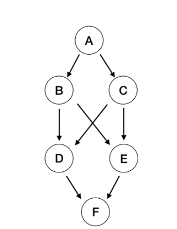

## 图论

- **图 的实现**

	- 邻接矩阵实现

		适用于稠密图
        
        - 边的表示

			矩阵的值表示为边的链接关系
            
        - 基本数据成员

			```python
            - 节点数量
            - 图的有向性
            - 边的数量
            ```
        
        - 基本操作

			- 返回节点的数量
			- 返回边的数量
			- 给定两个节点，判定两个点是否连接
			- 为两个节点添加边
			- 邻边迭代器，返回相邻节点
   
  - 邻接表实现

	 适用于稀疏图，操作同稠密图
     
- **图 的遍历**

	- 深度优先遍历

		- 递归写法

		```python
        def dfs(G, node, visited):
        	visited.add(node)
            
            for nbr in G.get_ngbs(node):
            	if nbr in visited:
                	continue
                dfs(G, nbr, visited)
        
        def DFSTraversal(G):
        	visited = set()
            for node in G.get_vertex:
            	if node not in visited:
                	dfs(G, node, visited)
        ```
        
        - 迭代写法

		```python
        def dfsIterative(G, start, dest):
        	stack = []
            visited = set()
            parent = {}
            stack.append(start)
            visited.add(start)
            
            while stack:
            	cur = stack.pop()
                
                if cur == dest:
                	return parent
                
                for nbr in G.get_ngbs(node):
                	if nbr not in visited:
                    	stack.append(nbr)
                        visited.add(nbr)
                        parent[nbr] = cur 
        ```
        
    - 广度优先遍历   

		- 迭代写法
		
        ```python
        from collections import deque
        
        def bfs(G, start, dest):
        	queue = deque()
            visited = set()
            parent = {}
            queue.append(start)
            
            while queue:
            	cur = queue.popleft()
                
                if cur == dest:
                	return parent
                
                for nbr in G.get_ngbs(node):
                	if nbr not in visited:
                    	queue.append(nbr)
                        visited.add(nbr)
                        parent[nbr] = cur 
        ```

- 图的基本问题

 - Dijstra 算法

	基于 优先队列 的 bfs
    
    ```python
    import heapq
    import math

    def init_distance(G, start):
        distance = {start:0}

        for node in G:
            if node is not start:
                distance[node] = math.inf
	
    def Dijstra(G, start):
    	priority_queue = []
    	heapq.heappush(priority_queue, (0, start))
        
        visited = set()

        distance = init_distance(G, start)
        parent = {start:start}
        
        while priority_queue:
        	dis, cur  = heapq.heappop(priority_queue)
            visited.add(cur)
            
            for nbr in node.neibours()：
            	if nbr not in visited:
                	if dis + getdis(cur, nbr) < distance[nbr]:
                    	distance[nbr] = dis + getdis(cur, nbr)
                        parent[nbr] = cur 	
                        heapq.heappush(priority_queue, (distances[nbr], nbr))
    ```
    
  - 连通性判断

    - 第一种：传入图的格式G

    ```python
    def nums_connected(G):
        visited = set()
        result = 0
        for node in G:
            if node not in visited:
                dfs(node, visited)  # 标记
                result += 1
        return result

    def dfs(node, visited):
        visited.add(nbr)
        for nbr in node.adjcents():
            if nbr not in visited:
                dfs(nbr, visited)
    ```

    - 第二种：传入图的矩阵形式 4连通

    ```python
    def nums_connected(G):
        m = len(G)
        n = len(G[0])
        result = 0
        visited = [[0] * (m + 2) for _ in range(n + 2)] # 保证边界合法
        for i in range(1, m + 1):
            for j in range(1, n + 1):
                if G[i][j] == 1 and visited[i][j] != 1:  # 没有访问过
                    dfs(i, j, G, visited)
                    result += 1
        return result

    def dfs(i, j, G, visited):
        visited[i][j] = 1
        for nbr in neibours(i, j):
            if visited[nbr[0]][nbr[1]] == 0 and G[nbr[0]][nbr[1]] == 1:
                dfs(nbr[0], nbr[1], G, visited)

    def neibours(i, j):
        return [[i - 1, j], [i + 1, j], [i, j - 1], [i, j + 1]]  # 四连通
    ```
        
    
 - 图的拓扑排序 算法   

	
    
    - 排序思想

		即A的入度为0，B的入度为1，C的入度为1，D的入度为2，E的入度为2，F的入度为2

		在DAG的拓扑排序中，每次都选取入度为 0 的点加入拓扑队列中，再删除与这一点连接的所有边。

		首先找到入度为0的点A，把A从队列中取出，同时添加到结果中并把A相关的指向移除，即B、C的入度减少1变为0并将B，C添加到队列中，再从队列首部取出入度为0的节点，以此类推，最后输出结果，完成DAG的拓扑排序。

	- 结果： ['A', 'C', 'B', 'E', 'D', 'F']

	```python
    def TopologicalSort(G):
        # init
        in_degree = dict((u,0) for u in G)

        for u in G:
            # G[u] 存储了 u 的出度节点 v 是 u 的出度（u是v的入度）
            for v in G[u]:
                in_degree[v] += 1

        queue = []

        for u in G:
            if in_degree[u] == 0:
                queue.append(u)

        res = []

        while queue:
            node = queue.pop(0)
            res.append(node)

            for v in G[node]:
                in_degree[v] -= 1
                if in_degree[v] == 0:
                    queue.append(v)

        return res
    ```


#### **1. 迷宫1**

- 题目描述

	迷宫中有一个球，有空旷的空间和墙壁。 球可以通过向上、向下、向左或向右滚动来穿过空位。给定球的起始位置、目的地和迷宫，判断球是否可以停在目的地。

	迷宫由一个二元二维数组表示。 1 表示墙壁，0 表示空白空间。 你可以假设迷宫的边界都是墙。 起始坐标和目标坐标由行和列索引表示。

	
    
- 解题思路

	每次向$4$邻域移动一个位置，递归到下一步移动，相邻节点的链接关系依靠 $4$ 邻域定义   
    
- 核心代码

	```python
    def dfs(matrix, start, dest):
        visited = [[False] * len(matrix[0]) for i in range(len(matrix))]
        return dfsHelper(matrix, start, dest, visited)

    def dfsHelper(matrix, start, dest, visited):
    	# 递归终止条件判断
        if matrix[start[0]][start[1]] == 1:
            return False

        if visited[start[0]][start[1]]:
            return False
        if start[0] == dest[0] and start[1] == dest[1]:
            return True

        visited[start[0]][start[1]] = True
		
        # 符合条件则递归下去
        if (start[1] < len(matrix[0]) - 1):
            r = (start[0], start[1] + 1)
            if (dfsHelper(matrix, r, dest, visited)):
                return True

        if (start[1] > 0):
            l = (start[0], start[1] - 1)
            if (dfsHelper(matrix, l, dest, visited)):
                return True

        if (start[0] > 0):
            u = (start[0] - 1, start[1])
            if (dfsHelper(matrix, u, dest, visited)):
                return True

        if (start[0] < len(matrix[0]) - 1):
            d = (start[0] + 1, start[1])
            if (dfsHelper(matrix, d, dest, visited)):
                return True

        return False
    ```
    
#### **2. 迷宫2**

- 题目描述

	迷宫中有一个球，有空旷的空间和墙壁。 球可以通过向上、向下、向左或向右滚动来穿过空位。 **但它在撞到墙上之前不会停止滚动**。 当球停止时，它可以选择下一个方向。给定球的起始位置、目的地和迷宫，判断球是否可以停在目的地。迷宫由一个二元二维数组表示。 1 表示墙壁，0 表示空白空间。 你可以假设迷宫的边界都是墙。 起始坐标和目标坐标由行和列索引表示。
    
    
     
    
- 解题思路

	本题的区别主要在于相邻节点的定义不同，这里是方向上无阻拦的最远点作为 neighbour   
    
- 核心代码

	 ```python
    def dfs2(matrix, start, dest):
        visited = [[False] * len(matrix[0]) for i in range(len(matrix))]
        return dfsHelper2(matrix, start, dest, visited)

    def dfsHelper2(matrix, start, dest, visited):
        if matrix[start[0]][start[1]] == 1:
            return False

        if visited[start[0]][start[1]]:
            return False
        if start[0] == dest[0] and start[1] == dest[1]:
            return True

        visited[start[0]][start[1]] = True

        r = start[1] + 1
        l = start[1] - 1
        u = start[0] - 1
        d = start[0] + 1

        while (r < len(matrix[0]) and matrix[start[0]][r] == 0):  ##  right
            r += 1
        x = (start[0], r - 1)
        if (dfsHelper2(matrix, x, dest, visited)):
            return True

        while (l >= 0 and matrix[start[0]][l] == 0):  ##  left
            l -= 1
        x = (start[0], l + 1)
        if (dfsHelper2(matrix, x, dest, visited)):
            return True

        while (u >= 0 and matrix[u][start[1]] == 0): ##  up
            u -= 1
        x = (u + 1, start[1])
        if (dfsHelper2(matrix, x, dest, visited)):
            return True

        while (d < len(matrix) and matrix[d][start[1]] == 0): ##  down
            d += 1
        x = (d - 1, start[1])
        if (dfsHelper2(matrix, x, dest, visited)):
            return True

        return False  
     ```
     
#### **3. 迷宫3**  

- 题目描述

	迷宫中有一个球，有空旷的空间和墙壁。 球可以通过向上、向下、向左或向右滚动来穿过空位，**但它不会停止滚动，直到撞到墙壁**。 当球停止时，它可以选择下一个方向。给定球的起始位置、目的地和迷宫，<font color='red'>找到球停在目的地的最短距离</font>。 距离定义为球从起始位置（不包括）到目的地（包括）所经过的空位数。 如果球不能停在目的地，返回-1。迷宫由一个二元二维数组表示。 1 表示墙壁，0 表示空白空间。 你可以假设迷宫的边界都是墙。 起始坐标和目标坐标由行和列索引表示。
    
    
     
    
- 解题思路

	最短路径算法，使用 dijstra 算法
    
- 核心代码

	```python
    import heapq

    def shortestDistance(matrix, start, destination):
        def neighbors(matrix, node):
            for dir in [(-1, 0), (0, 1), (0, -1), (1, 0)]:
                cur_node, dist = list(node), 0
                while 0 <= cur_node[0] + dir[0] < len(matrix) and \
                      0 <= cur_node[1] + dir[1] < len(matrix[0]) and \
                      matrix[cur_node[0] + dir[0]][cur_node[1] + dir[1]] == 0:
                    cur_node[0] += dir[0]
                    cur_node[1] += dir[1]
                    dist += 1
                yield dist, tuple(cur_node)

        heap = [(0, start)]
        visited = set()
        while heap:
            dist, node = heapq.heappop(heap)
            if node in visited: continue
            if node == destination:
                return dist
            visited.add(node)
            for neighbor_dist, neighbor in neighbors(matrix, node):
            	heapq.heappush(heap, (dist + neighbor_dist, neighbor))

        return -1
    ```
    
#### **4. 迷宫4**

- 题目描述

	迷宫中有一个球，有空旷的空间和墙壁。球可以通过向上 (u)、向下 (d)、向左 (l) 或向右 (r) 滚动来穿过空位，**但它不会停止滚动，直到撞到墙壁**。当球停止时，它可以选择下一个方向。这个迷宫里还有一个洞。 <font color="red">球滚到洞上就会掉进洞里</font>。给定球位置、球洞位置和迷宫，**找出球如何通过移动最短距离落入球洞**。距离定义为球从起始位置（不包括）到球洞（包括）所经过的空位数。使用'u'、'd'、'l'和'r'输出移动方向。由于可能有几种不同的最短方式，您应该输出字典序最小的方式。如果球无法到达孔洞，则输出“不可能”。迷宫由一个二元二维数组表示。 1 表示墙壁，0 表示空白空间。你可以假设迷宫的边界都是墙。球和孔坐标由行和列索引表示。
    
- 解题思路

	 路径需要加入方向
     
- 核心代码

	```python
    import heapq

    def findShortestWay(maze, ball, hole):
        dirs = {'u' : (-1, 0), 'r' : (0, 1), 'l' : (0, -1), 'd': (1, 0)}

        def neighbors(maze, node):
            for dir, vec in dirs.items():
                cur_node, dist = list(node), 0
                while 0 <= cur_node[0]+vec[0] < len(maze) and \
                      0 <= cur_node[1]+vec[1] < len(maze[0]) and \
                      not maze[cur_node[0]+vec[0]][cur_node[1]+vec[1]]:
                    cur_node[0] += vec[0]
                    cur_node[1] += vec[1]
                    dist += 1
                    if tuple(cur_node) == hole:
                        break
                yield tuple(cur_node), dir, dist

        heap = [(0, '', ball)]
        visited = set()
        while heap:
            dist, path, node = heapq.heappop(heap)
            if node in visited: continue
            if node == hole: return path
            visited.add(node)
            for neighbor, dir, neighbor_dist in neighbors(maze, node):
                heapq.heappush(heap, (dist+neighbor_dist, path+dir, neighbor))

        return "impossible"
    ```
    
#### **5. floodfill**

- 题目描述

	图像由二维整数数组表示，每个整数表示图像的像素值（从 0 到 65535）。**给定一个坐标 (sr, sc) 表示填充的起始像素（行和列），以及像素值 newColor**，“填充”图像。要执行“填充”，请考虑起始像素，加上与起始像素颜色相同的四向连接到起始像素的任何像素，加上与这些像素四向连接的任何像素（也与这些像素具有相同的颜色） 起始像素），依此类推。 用 newColor 替换所有上述像素的颜色。最后，返回修改后的图像。
    
- 解题思路

	从给定起点开始染色，查找该点四邻域，递归的将四邻域的点进行染色
    
- 核心代码

	```python
    def floodFill(image, sr, sc, newColor):
        rows, cols, orig_color = len(image), len(image[0]), image[sr][sc]
        def traverse(row, col):
            if (not (0 <= row < rows and 0 <= col < cols)) or image[row][col] != orig_color:
                return
            image[row][col] = newColor
            [traverse(row + x, col + y) for (x, y) in ((0, 1), (1, 0), (0, -1), (-1, 0))]
        if orig_color != newColor:
            traverse(sr, sc)
        return image
    ```
    
#### **6. Friend Circles**   

- 题目描述

	一个班有N个学生。 他们有些是朋友，有些则不是。 他们的友谊本质上是传递性的。 例如，如果A是B的直接朋友，B是C的直接朋友，那么A就是C的间接朋友。我们定义朋友圈是一群直接或间接朋友的学生。给定一个$ N*N $矩阵$ M $，表示班级学生之间的朋友关系。 如果 $M[i][j] = 1$，则第 $i$ 个和第 $j$ 个学生是彼此的直接朋友，否则不是。 你必须输出所有学生的朋友圈总数。
    
    ```python
    Input: 

    [[1,1,0],

    [1,1,0],

    [0,0,1]]

    Output: 2

    Explanation:The 0th and 1st students are direct friends, so they are in a friend circle. 

    The 2nd student himself is in a friend circle. So return 2.
    ```
    
- 解题思路

	标记当前的朋友，同时寻找的他的朋友，递归进行标记

- 核心代码

	```python
    def findCircleNum(M):
        def dfs(node):
            visited.add(node)
            for friend in range(len(M)):
                if M[node][friend] and friend not in visited:
                    dfs(friend)

        circle = 0
        visited = set()
        for node in range(len(M)):
            if node not in visited:
                dfs(node)
                circle += 1
        return circle
    ```
       
#### **7. Number of Islands**     

- 题目描述

	给定一个由“1”（陆地）和“0”（水）组成的二维网格图，计算岛屿的数量。 岛屿被水包围，由水平或垂直连接相邻陆地形成。 您可以假设网格的所有四个边都被水包围。
    
- 解题思路

	遍历每个网格，将该网格进行计数，并遍历 $4$ 邻域，递归处理每个节点
    
- 核心代码

	```python
    def numIslands(grid):
        if not grid:
            return 0
        count = 0
        for i in range(len(grid)):
            for j in range(len(grid[0])):
                if grid[i][j] == 1:
                    dfs(grid, i, j)
                    count += 1
        return count

    def dfs(grid, i, j):
        if i < 0 or j < 0 or i >= len(grid) or j >= len(grid[0]) or grid[i][j] != 1:
            return
        grid[i][j] = '#'
        dfs(grid, i + 1, j)
        dfs(grid, i - 1, j)
        dfs(grid, i, j + 1)
        dfs(grid, i, j - 1)
    ```
    
#### **8. Max Area of Island**  

- 题目描述

	给定一个由 0 和 1 组成的非空 2D 阵列网格，岛是一组 1（代表陆地）以 4 个方向（水平或垂直）连接。您可以假设网格的所有四个边缘都被水包围。在给定的二维数组中找到一个岛的最大面积。 （如果没有岛屿，则最大面积为 0。）
    
- 解题思路

	 解题思路如上题
     
- 核心代码

	```python
    def maxAreaOfIsland(grid):
        m, n = len(grid), len(grid[0])

        def dfs(i, j):
            if 0 <= i < m and 0 <= j < n and grid[i][j]:
                grid[i][j] = 0
                return 1 + dfs(i - 1, j) + dfs(i, j + 1) + dfs(i + 1, j) + dfs(i, j - 1)
            return 0

        result = 0
        for x in range(m):
            for y in range(n):
                if grid[x][y]:
                    result = max(result, dfs(x, y))
        return result
    ```
    
#### **9. Employee Importance**     

- 题目描述

	将获得员工信息的数据结构，其中包括员工的唯一 ID、重要性值和直接下属的 ID。例如，员工 1 是员工 2 的领导，员工 2 是员工 3 的领导。它们的重要性值分别为 15、10 和 5。 那么员工1有[1, 15, [2]]这样的数据结构，员工2有[2, 10, [3]]，员工3有[3, 5, []]。 请注意，虽然员工 3 也是员工 1 的下属，但这种关系并不直接。现在给定一个公司的员工信息和一个员工id，你需要返回这个员工和他所有下属的总重要性值。 
    
 	```python
    Input: [[1, 5, [2, 3]], [2, 3, []], [3, 3, []]], 1

	Output: 11
    
    员工1的重要性值为5，他有两个直接下属：员工2和员工3。他们的重要性都为3。所以员工1的总重要性值为5 + 3 + 3 = 11
    ```
    
- 解题思路

	 处理当前员工的重要性，遍历下属，递归的处理下属
     
- 核心代码

	```python
    class Employee(object):
        def __init__(self, id, importance, subordinates):
            # It's the unique id of each node.
            # unique id of this employee
            self.id = id
            # the importance value of this employee
            self.importance = importance
            # the id of direct subordinates
            self.subordinates = subordinates
            
      def getImportance(employees, id):
        table = {emp.id: emp for emp in employees}

        def dfs(emp):
            if emp.subordinates == []:  # base case
                return emp.importance
            else:  # recursive case
                value = emp.importance
                for sub in emp.subordinates:
                    value += dfs(table[sub])
                return value

   	 return dfs(table[id])      
    ```
    
#### **10.  Is Graph Bipartite**   

- 题目描述

	给定一个无向图，当且仅当它是二部图时才返回真。 回想一下，如果我们可以将它的一组节点拆分为两个独立的子集 A 和 B，使得图中的每条边在 A 中都有一个节点，在 B 中具有另一个节点，那么该图是二部图。该图以以下形式给出： graph[i] 是索引 j 的列表，节点 i 和 j 之间存在边。 每个节点都是一个介于 0 和 graph.length - 1 之间的整数。没有自边或平行边：graph[i] 不包含 i，并且它不包含任何元素两次。
    
    
    
    
- 解题思路    
	
    将其作为着色问题。
    
    我们的目标是尝试使用两种颜色为图形着色，看看是否有任何相邻节点具有相同的颜色。 为每个节点初始化一个 color[] 数组。 下面是 colors[] 数组的三种状态：

	-1：没有被着色。

	0：蓝色。

	1：红色。

	对于每个节点，如果它没有被着色，用一种颜色来着色它。 然后使用另一种颜色为其所有相邻节点 (DFS) 着色。 如果已着色，请检查当前颜色是否与将用于着色的颜色相同。
    
- 核心代码

	```python
    def isBipartite(graph):
        color = {}
        def dfs(pos):
            for i in graph[pos]:
                if i in color:
                    if color[i] == color[pos]: return False
                else:
                    color[i] = color[pos] ^ 1 # 异或
                    if not dfs(i): return False
            return True

        for i in range(len(graph)):
            if i not in color: color[i] = 0
            if not dfs(i): return False
        return True
    ```
    
#### **11.  Pacific Atlantic Water Flow** 

- 题目描述

	给定一个由非负整数组成的 $m \times n$ 矩阵，表示大陆中每个单元格的高度，“太平洋”接触矩阵的左侧和顶部边缘，“大西洋”接触右侧和底部边缘。水只能沿四个方向（上、下、左或右）从一个单元流向另一个高度相等或更低的单元。找到水可以流向太平洋和大西洋的网格坐标列表。
    
    
    
- 解题思路

	矩阵中的元素表示水流的起始高度，流水从高相低流动，从多种满足条件的起始点开始进行遍历，查找符合条件的点
    
- 核心代码    

	```python
    def pacificAtlantic(matrix):

        if not matrix: return []
        directions = [(1,0),(-1,0),(0,1),(0,-1)]
        m = len(matrix)
        n = len(matrix[0])
        p_visited = [[False for _ in range(n)] for _ in range(m)]

        a_visited = [[False for _ in range(n)] for _ in range(m)]
        result = []

        for i in range(m):
            # p_visited[i][0] = True
            # a_visited[i][n-1] = True
            dfs(matrix, i, 0, p_visited, m, n)
            dfs(matrix, i, n-1, a_visited, m, n)
        for j in range(n):
            # p_visited[0][j] = True
            # a_visited[m-1][j] = True
            dfs(matrix, 0, j, p_visited, m, n)
            dfs(matrix, m-1, j, a_visited, m, n)

        for i in range(m):
            for j in range(n):
                if p_visited[i][j] and a_visited[i][j]:
                    result.append([i,j])
        return result

    def dfs(matrix, i, j, visited, m, n):
        # when dfs called, meaning its caller already verified this point 
        visited[i][j] = True
        for dir in [(1,0),(-1,0),(0,1),(0,-1)]:
            x, y = i + dir[0], j + dir[1]
            if x < 0 or x >= m or y < 0 or y >= n or visited[x][y] or matrix[x][y] < matrix[i][j]:
                continue
            dfs(matrix, x, y, visited, m, n)
    ```
    
#### **12.  Longest Increasing Path in a Matrix**     

- 题目描述

	给定一个整数矩阵，找出最长递增路径的长度。您可以从每个单元格向四个方向移动：向左、向右、向上或向下。 您不能对角移动或移动到边界之外（即不允许环绕）。
    
    
    
    
    
- 解题思路

	 遍历每个节点作为起始节点，递归搜索最长路径，但是会存在大量重复计算
     
- 核心代码

	```python
    def longestIncreasingPath(matrix):
        if not matrix: return 0
        directions = [(1,0),(-1,0),(0,1),(0,-1)]
        m = len(matrix)
        n = len(matrix[0])
        cache = [[-1 for _ in range(n)] for _ in range(m)]
        res = 0
        for i in range(m):
            for j in range(n):
                cur_len = dfs(i, j, matrix, cache, m, n)
                res = max(res, cur_len)
        return res

    def dfs(i, j, matrix, cache, m, n):
        if cache[i][j] != -1:
            return cache[i][j]
        res = 1
        for direction in [(1,0),(-1,0),(0,1),(0,-1)]:
            x, y = i + direction[0], j + direction[1]
            if x < 0 or x >= m or y < 0 or y >= n or matrix[x][y] <= matrix[i][j]:
                continue
            length = 1 + dfs(x, y, matrix, cache, m, n)
            res = max(length, res)
        cache[i][j] = res
        return res
    ```
    
#### **13.  01 Matrix**    

- 题目描述

	给定一个由 0 和 1 组成的矩阵，为每个单元格找到最近的 0 的距离。两个相邻单元格之间的距离为 1。
    
    ```python
    Example 1:

    Input:

    0 0 0

    0 1 0

    0 0 0

    Output:

    0 0 0

    0 1 0

    0 0 0

    Example 2:

    Input:

    0 0 0

    0 1 0

    1 1 1

    Output:

    0 0 0

    0 1 0

    1 2 1
    ```
    
- 核心代码

	```python
    def updateMatrix(matrix):
        q, m, n = [], len(matrix), len(matrix[0])
        for i in range(m):
            for j in range(n):
                if matrix[i][j] != 0:
                    matrix[i][j] = 0x7fffffff
                else:
                    q.append((i, j))
        for i, j in q:
            for r, c in ((i, 1+j), (i, j-1), (i+1, j), (i-1, j)):
                z = matrix[i][j] + 1
                if 0 <= r < m and 0 <= c < n and matrix[r][c] > z:
                    matrix[r][c] = z
                    q.append((r, c))
        return matrix
    ```
    
#### **14. Accounts Merge**   

- 题目描述

	给定一个列表accounts，每个元素accounts[i] 是一个字符串列表，其中第一个元素accounts[i][0] 是一个名称，其余元素是代表该账户的电子邮件的email。现在，我们想合并这些帐户。 如果两个帐户有共同的电子邮件，则两个帐户肯定属于同一个人。 请注意，即使两个帐户具有相同的名称，它们也可能属于不同的人，因为人们可能具有相同的名称。 一个人最初可以拥有任意数量的帐户，但他们的所有帐户肯定都具有相同的名称。合并帐户后，按以下格式返回帐户：每个帐户的第一个元素是名称，其余元素按排序顺序为电子邮件。 帐户本身可以按任何顺序返回。
    
    ```python
    Example 1:
    accounts = [
        ["John", "johnsmith@mail.com", "john00@mail.com"], 
        ["John", "johnnybravo@mail.com"], 
        ["John", "johnsmith@mail.com", "john_newyork@mail.com"], 
        ["Mary", "mary@mail.com"]
    ]
    
    Output = [
        ["John", 'john00@mail.com', 'john_newyork@mail.com', 'johnsmith@mail.com'],  
        ["John", "johnnybravo@mail.com"], 
        ["Mary", "mary@mail.com"]
    ]
    
    Explanation: 

    The first and third John's are the same person as they have the common email "johnsmith@mail.com".

    The second John and Mary are different people as none of their email addresses are used by other accounts.

    We could return these lists in any order.
    ```
    
- 解题思路    

	```python
    - 我们根据每个帐户在帐户列表中的索引为每个帐户提供一个 ID。

		[
            ["John", "johnsmith@mail.com", "john00@mail.com"], # Account 0
            ["John", "johnnybravo@mail.com"], # Account 1
            ["John", "johnsmith@mail.com", "john_newyork@mail.com"],  # Account 2
            ["Mary", "mary@mail.com"] # Account 3
        ]
   
   - 接下来，构建一个将电子邮件映射到帐户列表的 emails_accounts_map，可用于跟踪哪个电子邮件链接到哪个帐户。 这本质上是我们的图表。
   	
    	# emails_accounts_map of email to account ID
        {
          "johnsmith@mail.com": [0, 2],
          "john00@mail.com": [0],
          "johnnybravo@mail.com": [1],
          "john_newyork@mail.com": [2],
          "mary@mail.com": [3]
        }
        
   - 接下来，我们对帐户列表中的每个帐户进行 DFS 并查找 emails_accounts_map 以告诉我们哪些帐户通过常用电子邮件链接到该特定帐户。 这将确保我们只访问每个帐户一次。 这是一个递归过程，我们应该收集一路上遇到的所有电子邮件。
   - 最后，对收集的电子邮件进行排序并将其添加到最终结果中。
    ```
    
- 核心代码

	```python
    def accountsMerge(accounts):
        from collections import defaultdict
        visited_accounts = [False] * len(accounts)
        emails_accounts_map = defaultdict(list)
        res = []
        # Build up the graph.
        for i, account in enumerate(accounts):
            for j in range(1, len(account)): #email starts from 2nd
                email = account[j]
                emails_accounts_map[email].append(i)

        print(emails_accounts_map)
        # DFS code for traversing accounts.
        def dfs(i, emails):
            if visited_accounts[i]:
                return
            visited_accounts[i] = True
            for j in range(1, len(accounts[i])):
                email = accounts[i][j]
                emails.add(email)
                for neighbor in emails_accounts_map[email]:
                    dfs(neighbor, emails)
        # Perform DFS for accounts and add to results.
        for i, account in enumerate(accounts):
            if visited_accounts[i]:
                continue
            name, emails = account[0], set()
            dfs(i, emails)
            res.append([name] + sorted(emails))
        return res
    ```
    
#### **15. Word Ladder**    

- 题目描述

	给定两个单词（beginWord 和 endWord），以及一个字典的单词列表，找到从 beginWord 到 endWord 的最短转换序列的长度，使得：一次只能更改一个字母。 每个转换后的词都必须存在于词表中。 请注意，beginWord 不是转换后的单词。 例如，鉴于：

    beginWord = "hit"

    endWord = "cog"

    wordList = ["hot","dot","dog","lot","log","cog"]

    最短的转换是“hit”->“hot”->“dot”->“dog”->“cog”，

    返回其长度 5。
    
- 解题思路

	最短路径问题，使用bfs
    
- 核心代码

	```python
    from collections import deque
    def ladderLength(beginWord, endWord, wordList):
        wordSet=set(wordList)
        wordSet.add(endWord)
        queue = deque([[beginWord, 1]])
        while queue:
            word, length = queue.popleft()
            if word == endWord:
                return length
            # 广度优先遍历    
            for i in range(len(word)):
                for c in 'abcdefghijklmnopqrstuvwxyz':
                    next_word = word[:i] + c + word[i+1:]
                    if next_word in wordSet:
                        wordSet.remove(next_word)
                        queue.append([next_word, length + 1])
        return 0
    ```
    
    
    
#### **16. Word Ladder II**    

- 题目描述

	给定两个单词（beginWord 和 endWord），以及一个字典的单词列表，找出所有从 beginWord 到 endWord 的最短转换序列，使得：一次只能更改一个字母 每个转换后的单词都必须存在于单词列表中。 请注意，beginWord 不是转换后的单词。 例如，

    鉴于：

    beginWord = "hit"

    endWord = "cog"
    
    wordList = ["hot","dot","dog","lot","log","cog"]
    
    输出：
     [
    ["hit","hot","dot","dog","cog"],
    ["hit","hot","lot","log","cog"]
  ]
  
- 解题思路

	需要 加入打印路径

- 核心代码

	```python
    from collections import defaultdict
    import string
    def findLadders(start, end, wordList):
        dic = set(wordList)
        dic.add(end)
        level = {start}
        parents = defaultdict(set)
        while level and end not in parents:
            next_level = defaultdict(set)
            for node in level:
                for char in string.ascii_lowercase:
                    for i in range(len(start)):
                        n = node[:i] + char + node[i+1:]
                        if n in dic and n not in parents:
                            next_level[n].add(node)
            level = next_level
            parents.update(next_level)
        res = [[end]]
        print(parents)
        while res and res[0][0] != start:
            res = [[p]+r for r in res for p in parents[r[0]]]
        return res
    ```